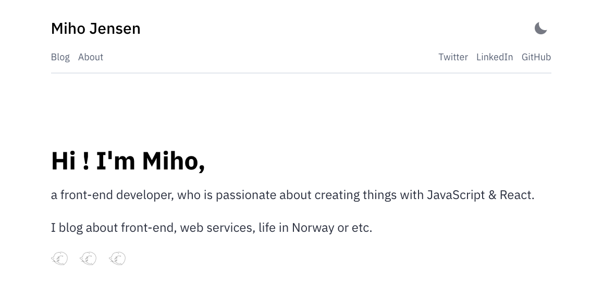

  

<h1 align="center">
  mihojen.dev
</h1>

This is my personal blog site, built using Gatsby Theme [`@lekoarts/gatsby-theme-minimal-blog`](https://github.com/LekoArts/gatsby-themes/tree/main/themes/gatsby-theme-minimal-blog), and I added some modifications.

In this site, I blog about front-end, web services, and my interests, etc.

## Dev Notes
To shadow compontens, here is the directory.

- Original: node_modules/@lekoarts/gatsby-theme-minimal-blog/src/components/

- Shadow: my-site-directory/src/@lekoarts/gatsby-theme-minimal-blog/components
Shadowing components i

To learn about shadowing, check [Shadowing in Gatsby Themes](https://www.gatsbyjs.com/docs/how-to/plugins-and-themes/shadowing/).