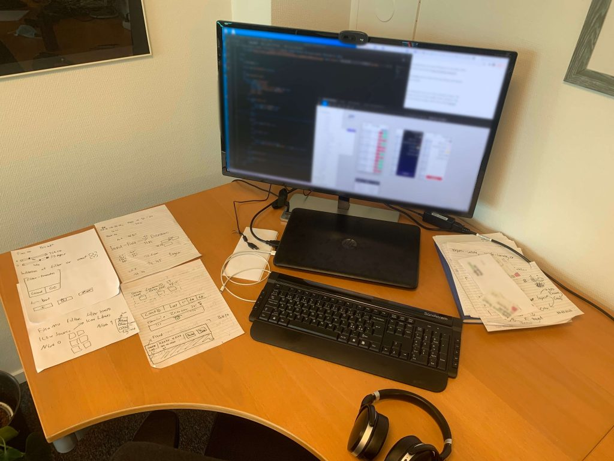
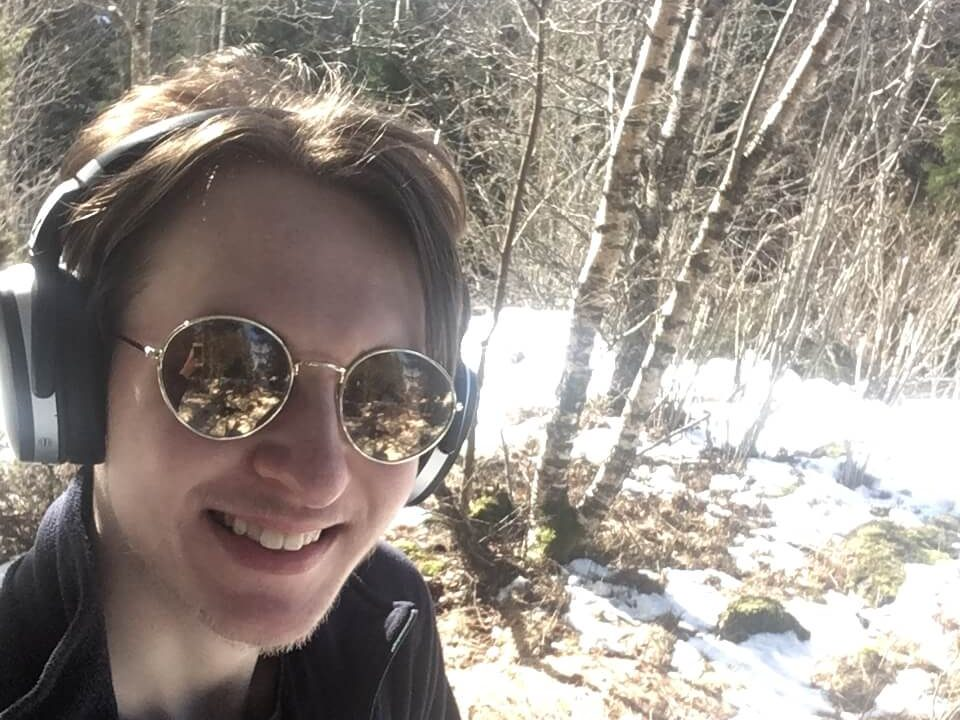
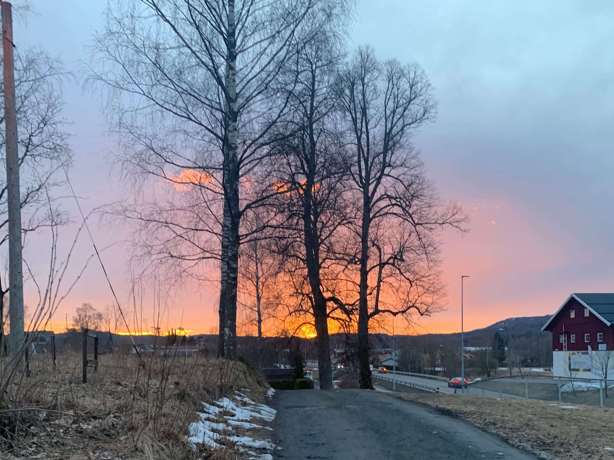

> この記事は、2021年4月に公開された旧ブログサイトmihonorge (https://miho-norge.com) のリライト記事です。

今回は、ノルウェー・オスロ在住のRaymondさんにお話を伺いました。

Raymondさんは、大学で英語を専攻しながらも、半年間のプログラミング独学期間を経て、オスロの企業にWeb developerとして就職をされました。
2021年4月から仕事を始められ、Full-stack developer要員として、フロントエンドからバックエンドまで業務を担っているそうです。

経験を重視するノルウェーで、内定を勝ち取るために努力されてきたことや、現在の活動、ノルウェーでのワークスタイルについて教えていただきました。

## プログラミングの勉強と就職活動

### Web developerを目指し始めてからの勉強期間

- はじめに、Web developerを目指し始めたきっかけを教えてください。

大学では英語を専攻していましたが、卒業後は英語を教える仕事などは正直やりたいと思えなくて、将来のことを考えたときに、Web developerの仕事が良いと思いました。
ただ、3年間大学でプログラミングを学ぶには長すぎると感じたので、独学することにしたんです。

つまらなければ辞めようと思っていましたが、3ヶ月ほどプログラミングの勉強を続けていくうちに楽しいと感じて、結果的に半年間の独学を経てWeb developerになりました。

- どのように勉強してきたのですか？

基本的に独学でC#と.NETを勉強してきましたが、ただ単純にプログラミング言語を勉強するのではなく、自分自身でプログラムを作ることを意識しました。
プログラムの複雑な問題を理解することにも繋がるので、まずは自分が気になるサービスを見つけて、自分自身で作ってみることが自然で良い勉強法だと思います。

また、企業側は大学の資格よりも、「どんなものが作れるのか」を見ているので、自分でサービスを作ってCVにポートフォリオとして載せることが良いアピール材料になります。

### 就職活動

- Web developerの求人情報を見ると、「英語OK」と記載されている場合がありますが、実際のところ「ノルウェー語」は必須だと思いますか？

そうですね。
私の働いている会社のように小さな会社の場合は、自社のサービス（ソフトウェアなど）を使っている他の会社から問合せが入る時など、ほぼ全てのシチュエーションでノルウェー語を使いますね。

ノルウェー政府が管理している会社で働く場合も（ソフトウェアの供給先がノルウェー政府）、ノルウェー語を理解する必要があります。
実際にはノルウェーのWeb developmentの仕事は、政府のためにソフトウェアを作っている会社が多いので、ノルウェー語の必要性が広がりました。

- なるほど。政府公認プロジェクトであれば、ノルウェー語は必須ですね。

はい。実際には多くのノルウェー人が英語を話せますが、上の世代では英語があまり話せない人がいるため、実際のところコミュニケーションにはノルウェー語（または他の北欧語）を話す必要があると思います。

- 就職活動は大変でしたか？

経験がない人にとっては仕事を見つけるのがとても大変です。
数十件履歴書を送りました。返事がきたのは半分くらいですが、ほとんどは断られました。応募して3ヶ月経ってからようやく返事がきた会社も…。

大きい会社はエージェントを使って仕事を募集する場合もあります。
私の場合、求人内容と条件がマッチしていないのにも関わらず、エージェントから何回も面接に招待されたり、面接したあげく、「あなたは条件に合っていない」と断られました。
じゃあ何で面接に呼んだのか…（笑）エージェントはできるだけ多くの面接をしたかったのでしょうが、エージェントの方がプログラミングについて詳しくないので、私にはその方法が合いませんでした。

- それでも自ら仕事を獲得したのは、しっかりと準備されてきたからだと感じます。そもそも学生は仕事経験がないところからのスタートだと思いますが、最初の仕事を見つけるのは相当大変ですよね？

はい。そのためにノルウェーでは、6ヶ月の無給インターンシップで職業経験を積む大学生がたくさんいます。
個人的に無給で働くのは良くないことだと思いますが、経験を得るためには普通のことのようです。

- Raymondさんの場合は、実績をアピールしたとのことですが、どのようなポートフォリオを作りましたか？

チェックリストのアプリと、日本語辞書のWebアプリを作りました。
面接の時に、ポートフォリオを見せながら、どんな言語を使ってサービスを作ったのか自分をアピールできたことで、今の仕事を手に入れることができたと思います。

- Web developerとして仕事を見つけるコツはありますか？

ノルウェーでは、Finn.no()で仕事を見つけることができますが、developerの世界ではあまり一般的ではありません。

- ノルウェーはコネ社会とよく聞きますが、developerはどうでしょう？

Finnで仕事を探すよりも、プログラミングのイベントや大会に参加して、人を通じて仕事を見つけるのが良い方法です。
赤の他人にCVを送るよりも、devloper同士のコネクションを広げることで、仕事を紹介してもらえることが多くなります。
今年はコロナの影響でイベントに参加することが難しかったので、自力で探しました。

## ノルウェーでWeb developerとして働く

### 働き方

- ノルウェーでWeb developerの需要はあると感じますか？

はい。Web developerの需要はとても高いですね。
オスロをはじめとして、ノルウェー全体でも主要都市は仕事があると思います。
特にC#ができる人が少ないので、C#と.NETでWebアプリが作れる人は強いと思います。

- Raymondさんはどんな会社で働いていますか？良ければ仕事内容なども教えてください。

港のコンテナ船に関わるソフトウェアを開発している会社でFull-stack developerとして働いています。
今はWebサイトのリニューアルのためにフロントエンド部分を任せてもらったり、新しいソフトウェアの開発のために企画を担当しています。

実は元々フロントエンドが好きじゃないと思ってましたが、やってみたら面白いことに気がつきました（笑）
小さい会社なので、色々なことを任せて貰えることと、自由に働かせて貰っていてとても楽しいです。

### 仕事に対する想い

- 仕事をしていてやりがいを感じることや、好きなところはありますか？

プロダクトを作ることにやりがいを感じます。
例えば、自分が作ったデザインを社内でプレゼンテーションした時に、「良いね！」と評価して貰えると嬉しい気持ちになります。あとは、ランチの時間などに同僚や上司と話す時が楽しいですね。
ディベロッパーならではの悩みを理解し合えることや、問題を解決するために話し合うことが面白いです。

- 仕事をする上で大切にしていることはありますか？

プログラミングの技術力よりもコミュニケーション力の方が仕事をする上では大切だと思っています。

- 今後の目標はありますか？

まだ仕事を始めたばかりなので大きな目標はありませんが、これから経験を積んで自分の価値を見つけていきたいです。
もっと立派なディベロッパーを目指していきます！

## ノルウェー

- ずばり、ノルウェーの好きなところを教えてください。

ワーキングカルチャーがとても好きです。
8時間以上働くことはほとんどないですし、割と自由に働ける環境が魅力的です。逆にどうしてノルウェーが好きなんですか？

- 私にとってノルウェーの自然は美しくて最高ですね。

そうですね。ノルウェーの自然も大好きです！
ノルウェーに住んでいたら自然を感じられないところに住むのは逆に難しいと思います。
首都のオスロでさえも、身近に自然を感じる場所がたくさんあって、居心地が良いです。

- さいごに、ノルウェーでWeb developerを目指す人のためにアドバイスがあればお願いします！

外国人がノルウェーでWeb developerになるためには、まずはノルウェー語を話せるようになると可能性が広がると思うので、ノルウェー語の勉強を頑張って欲しいです。

Web developerになるための道には、解けない難題に遭遇します。
その時に、悔しくて負けたような気持ちになったり、自分の能力に自身が無くなって、諦めたくなるかもしれません。
でも、そんな時でも諦めないでください。
障害がたくさんあって思うようにいかないのは、自然なことです。

自分に自信を持って頑張ってください！

## さいごに
現地の人でもノルウェーで仕事を見つけるのはそう簡単ではないと聞きます。
そんな中でも、自らの努力でWeb developerとしてのキャリアをスタートさせ、既に現場で活躍されているRaymondさんに取材させていただき、Web developerの仕事の可能性を感じました。

私自身もノルウェーでの仕事事情は気になっている分野でもあったので、貴重なお話が聞けて嬉しかったです。
ノルウェー語の勉強、もっと頑張らなければ…。

Raymondさん、ありがとうございました！

