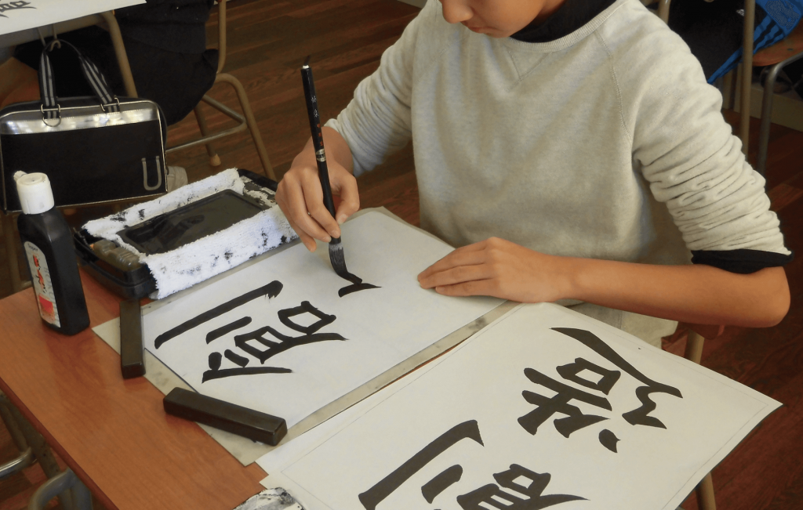
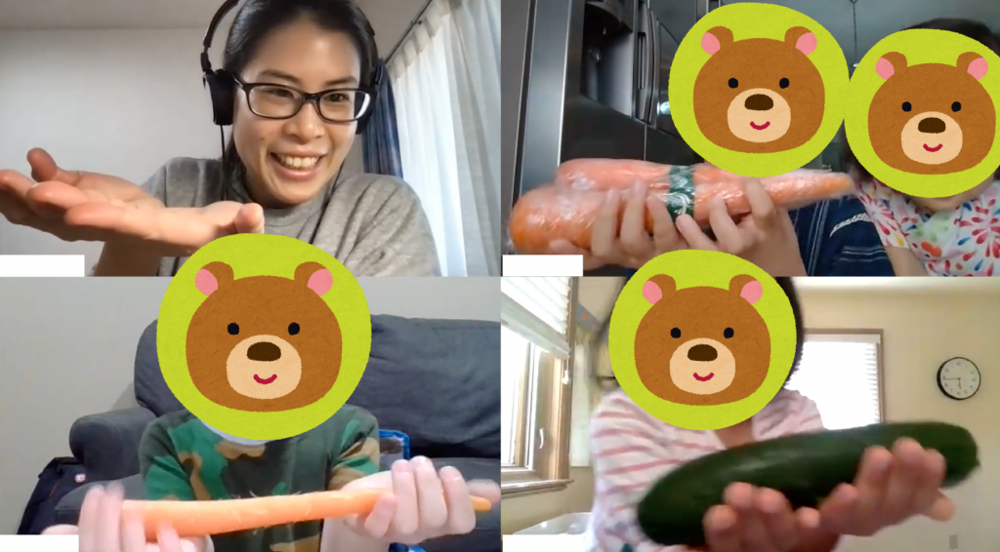
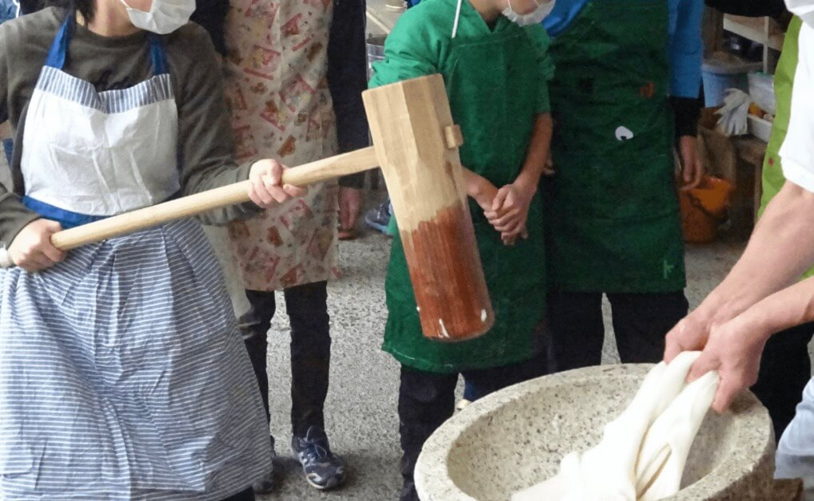
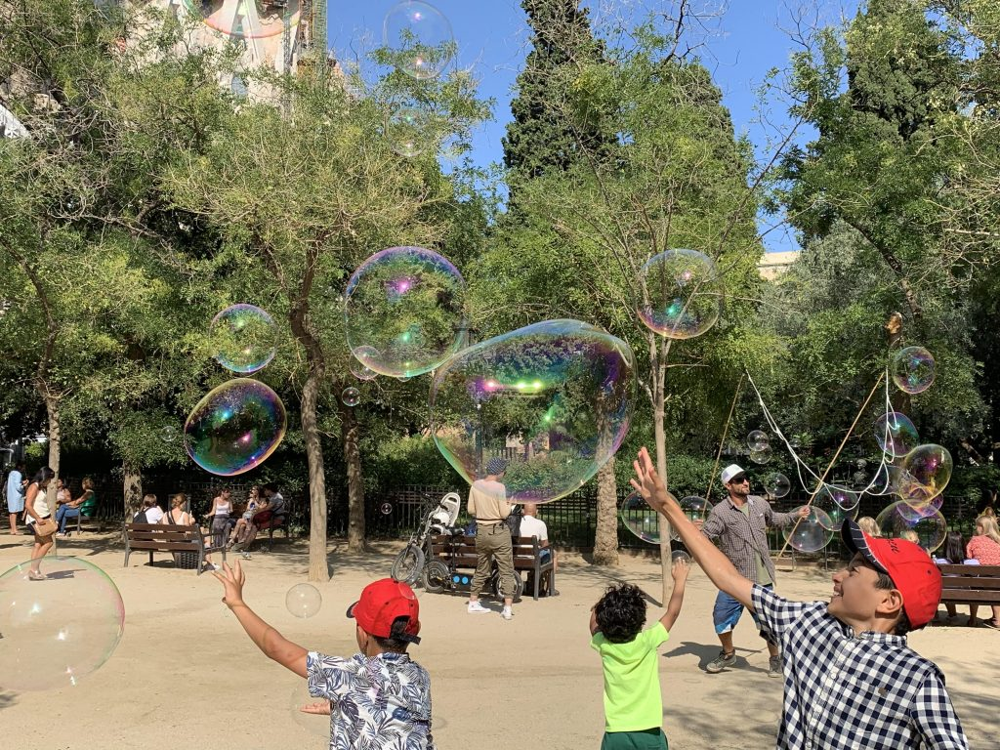

> この記事は、2021年4月に公開された旧ブログサイトmihonorge(https://miho-norge.com)のリライト記事です。

今回の記事は、取材企画です。
取材企画は、ノルウェー、働き方、Web、ライフスタイルなど、さまざまなトピックからピックアップしています。
出会いを通して、新しい考え方や価値観を得ることも多く、文字に残せるものは残していきたいと思っています。

さて、今回は兵庫県神戸市在住の笠原遥（かさはらはるか）さんにお話を伺いました。
遥さんは、公立の小学校教諭として7年間勤められ、現在はオンライン教師として海外に住む日本の子どもたちに向けて授業を行っています。（主に国語の授業）
今年スペインへ引越しを予定されており、現地ではスペイン語の勉強や学校でのボランティア活動を通して、国際理解を学ぶ活動を目指されています。

これまでの経験や現在の活動を中心に、日本の教育への想いや、オンラインで教える可能性、ワークスタイルについて教えていただきました。

## 小学校教諭としての経験

### 小学校教諭になろうと思ったきっかけと働き方

- 国際理解と学校教育の結びつきに強い想いがある遥さんですが、もともと小学校教諭を目指されたきっかけは何ですか？

小学校で教育実習をした時に、自分の好きな授業を10時間ほど持てる機会があり、そこで「もったいない」をテーマにした環境に関する授業をしたことがきっかけです。
子どもたちと討議できたことや、自分の想いを伝えられることが面白いと感じました。そこから、国際理解と環境問題をテーマにして小学校教諭になりたいと思いました。

- 素敵ですね。小学校での働き方はどうでしたか？

朝は子どもたちが登校する1時間前に出勤して、子どもたちが登校した後は授業や給食指導などのメインの業務をしていました。放課後も、授業の準備やトラブルがあれば家庭訪問を行うなど、やるべきことはたくさんありましたね。

- たしかに授業以外にも先生が担当している業務は山ほどある印象です。

本当にたくさんあります。
ただ、子育てしている人は働きやすい印象でした。定時が17時だったので、割り切って帰ることもできなくなかったと思います。

### 日本の子どもたちと教育について思うこと
- 遥さんが小学生だった頃の子どもたちと、今の子どもたちの性格や考え方の違いは感じますか？

私が小学生の頃は、あまり机に座って授業をする機会がなく、自然に活発に意見が言えるような討議型授業が多かったんです。
なので個人的には、今の子どもたちには繊細な子や自身が持てない子が多い気がします。
「しんどいけどちょっと頑張ってみよう」ということに乗り越えられない子が増えているように思います。

- 日本の小学校教育に対する想いや改善してほしいことはありますか？

たくさんあります（笑）
少人数制をもっと取り入れて欲しいです。
35人学級を目指すと文科省も言っていますが、1年生,2年生と順々で段階的に進められているようで、結局のところ野放しになっています。
私の周りの友人には、5,6年生の担任として40人クラスを受け持っている先生たちが普通にいますね…。

- 40人もですか？全員見るとなると大変ですね。

とくに今はコロナ禍で、間隔を空けようにも空けられないのが現状ですし、教室がいっぱいなので指導が行き届かないことも難しいところです。
教員の数も十分に足りていません。

- そうなると、子どもたちの意見も通りにくくなりますよね…。

はい。日本の教育は協調性を重要とされていますが、それだけではなくもっと個人の意見を言いやすい教育体制をつくることが大切だと思います。
頭が良くて考えているのに、想いを伝えられない子どもたちが多い理由には、色んなことを詰め込んで教えられているような、時間にゆとりのない教育背景があるのかなと感じます。

- なるほど。反対に、日本の小学校の良いところは何ですか？

現在海外の子どもたちに教えていて感じたことなのですが、規律が守られている教育文化は日本の小学校の良いところだと思います。
しっかり列に並んでクラス移動ができることや、時間通りに授業が進められることは日本では当たり前かもしれませんが、海外では難しいようです。

あとは、日本の算数の授業ですね。ヨーロッパだと数独で終わってしまうことや、高学年にならないと割り算を習わないこともあるようで、日本の算数を習わせたいと保護者の方からリクエストをいただくこともあります。
日本を含むアジア圏ではレベルの高い算数を学ぶことができる印象です。

## オンライン教師としての仕事

### オンライン教師を始めたきっかけと働き方

- 子どもたちの教育に向き合い、さまざまな経験をされてきた遥さんですが、小学校教諭を辞めて現在のオンライン教師の仕事を始めたきっかけは何でしょうか？

ずっと海外に行きたい気持ちを持ちつつも、仕事が楽しくてずるずる続けていたのですが、目標を叶えるために30歳を区切りにしてスペインに行くと決めました。
その後小学校教諭を辞め、海外に住みながらでも仕事を続けていけるオンライン教師の仕事を始めることにしたんです。

- 仕事が楽しいって素敵です。オンライン教師のお仕事も興味深いのですが、どのような活動をされているのですか？

海外に住んでいる日本人の子どもたちを中心に、4歳,5歳の幼稚園生から、6歳から11歳までの小学生に国語と希望の子には算数を教えています。
あとは、会話指導も行っていて、マンツーマンか最大5名のグループレッスンというスタイルになっています。

- 海外に住んでいる子どもたちに教えられているとのことですが、どのような生活ルーティンになっているのですか？

子どもたちの住んでいる国によって変わりますが、基本的に朝はアメリカから始まり、その後他の授業の準備をして、夕方にアジア、夜に中東、ヨーロッパ、と授業を行っています。

- そうなると日によっては、一日中教えてるなんてこともありますよね？

そうですね。やはり時差がバラバラなので、朝から深夜まで授業を持っています。
ただ、空き時間と週2日の休みを利用して、読書や映画をみて過ごしたり、レッスンに取り入れられることを考えたりしています。

### 学校で教えることとの違い

- 海外に住む子どもたちに教えることと、日本の小学校の子どもたちに教えることでは、どのようなことに違いを感じますか？

今教えている子どもたちは、第二言語として日本語を学んでいるので、あまり細かいことを言わないようにしています。
漢字の書き順とか本当に細かいんですよね（笑）
なので、個々のペースでゆっくり学んでもらえるように意識しています。

また、国や地域によって教育方針が違うという点で工夫をしています。
例えば、アジアでは厳しい指導のもとで学習していることもあり、私が結構厳しくしても子どもたちがついてきますね。
逆にヨーロッパでは、ゆるやかに育ってきた子が多いので、「やりなさい！」という感じではなく、話し合うことやゲーム感覚で漢字が覚えられるような方法をとっています。

- 子ども一人ひとりの個性にあった教えかたができることは素晴らしいと思います。きっと保護者の方たちは遥さんに安心してお任せできるんだなと感じます。

私自身も勉強させてもらっている感覚で、日本の自分のやり方だけでは通用しない部分があるので、臨機応変に対応できる力を養ってもらってます。

- やりがいを感じるのはどんな時ですか？

子どもたちに「早くレッスンしたい」「楽しい」って思ってもらえることが嬉しいですし、保護者の方からフィードバックを貰えることもありがたいと思っています。
子どもたちを通して海外の教育事情を知れるというのは、この仕事のやりがいでもありますね。

- さらにこれから挑戦していきたいことはありますか？

オンラインで教える可能性を広げて、もっと日本の文化を伝えていきたいです。
オンラインだと体験的授業ができないデメリットがあるので、日本の竹馬や餅つきなどの動画を見せてあげたいです。
積極的にイベントを開催して、普段会えないような友達とみんなで折り紙をやってみたり、ゲームをしてみたり、交流を深めることを目標にしています。

あとは、海外に住んでいる子どもたちの環境問題に対する考えや、どのようなことを学校で勉強しているのか知りたいです。
4年生, 5年生の子どもたちとは、少しずつ環境問題について話し合える時間を作っています。
低学年の子どもたちは、日本語力的に討論することが難しいのですが、今後できるようになったら考えを聞いてみたいですね。

## 今後について

- もうすぐスペインに渡られるとのことですが、スペインの好きなところを教えてください。

情深いスペイン人の人柄や、自然と風景に魅力を感じます。あとは、食べ物が美味しいところですね。日本人の口にも合ってるような気がする一方で、シンプルな味付けで食事が楽しめるところが好きです。

- 私もスペインの自然を見てみたいです。スペインでの生活をスタートさせたら、挑戦したいことは何でしょうか？

まずは語学学校でスペイン語を身につけ、慣れてきたらスペインの小学校でボランティアさせてもらいたいなと考えています。
オンラインで日本の子どもたちに向けて「環境問題」や「国際理解」について、日本との違いを教えられたら嬉しいです。

もう一つは、「キャリア教育」に力を入れていきたいです。
なりたい職業に関することだけではなく、一人の人間が色々な仕事を経験していく中でどういった学びがあるのかを伝えられたら良いなと思っています。

- それではさいごに、次世代の子どもたちに伝えたいことはありますか？

学校で学ぶことだけではなく、国際的な広い視野を持って、物事を考えていけるようになって欲しいと願っています。

## さいごに
すでに教育社会で活躍されている遥さんですが、環境問題や国際社会、キャリア教育を含む現代社会について深い考えと希望を持たれていることがとても伝わってきました。

この取材を通して、私たちが小学生だった頃と今とでは、社会は大きく変わっていながらも、日本の教育の在りかたに疑問を感じ、また魅力に気が付く機会となりました。
今私たちが次世代の子どもたちに貢献できることは何か改めて考えることが必要だと感じます。

遥さん、改めてありがとうございました！これからも応援しています。

