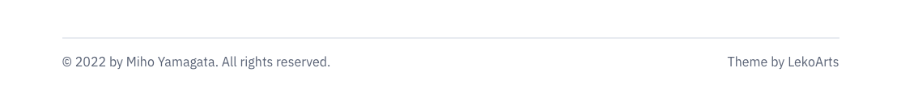
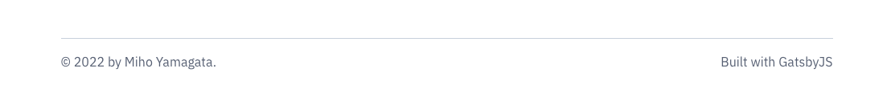

I used [minimal-blog provided by LekoArts](https://github.com/LekoArts/gatsby-starter-minimal-blog) when I built this site with GatsbyJS.
I love this theme, simple & stylish, and everything I needed is prepared. 
But I also wanted to modify a little.

This article introduces how to modify Gatsby theme, and what "Shadowing" is.

## What is shadowing
There is a function to modify componetns and files in Gatsby. 
Simply it's called "Shadowing" when you want to customize Gatsby themes.

You basically don't modiy original files directly, but make new files to override the original files.

Here is more information about shadowing.
[Shadowing in Gatsby Theme](https://www.gatsbyjs.com/docs/how-to/plugins-and-themes/shadowing/)

## Shadowing a footer file
Maybe it's nice to have a specific example.
So let's shadow a footer file this time, and change footer contents.

### Finding the file you want to modify 
First you find a file you want to modify from original theme directory.
```
node_modules/@lekoarts/gatsby-theme-minimal-blog/src/components/footer.tsx
```

### Create directory
Next you create ```src``` folder in your site directory, and also create ```@lekoarts/gatsby-theme-minimal-blog``` folders in ```src``` folder.
```
yoursite/src/@lekoarts/gatsby-theme-minimal-blog
```

### Copy the file
If you put components or files into ```yoursite/src/@lekoarts/gatsby-theme-minimal-blog``` which are same names as original one, you can customize the Gatsby theme.

This time, you modify ```footer.tsx``` in ```components``` folder, so you need to create ```components``` first.

```
yoursite/src/@lekoarts/gatsby-theme-minimal-blog/components
```

Then you can copy ```footer.tsx``` file from ```node_modules/@lekoarts/gatsby-theme-minimal-blog/src/components/footer.tsx```, and put into ```components``` folder you created now.

```
yoursite/src/@lekoarts/gatsby-theme-minimal-blog/components/footer.tsx
```

This is the contents in ```footer.tsx```
```tsx
/** @jsx jsx */
import { jsx, Link } from "theme-ui"
import useSiteMetadata from "../hooks/use-site-metadata"

const Footer = () => {
  const { siteTitle } = useSiteMetadata()

  return (
    <footer
      sx={{
        boxSizing: `border-box`,
        display: `flex`,
        justifyContent: `space-between`,
        mt: [6],
        color: `secondary`,
        a: {
          variant: `links.secondary`,
        },
        flexDirection: [`column`, `column`, `row`],
        variant: `dividers.top`,
      }}
    >
      <div>
        &copy; {new Date().getFullYear()} by {siteTitle}. All rights reserved.
      </div>
      <div>
        <Link
          aria-label="Link to the theme's GitHub repository"
          href="https://github.com/LekoArts/gatsby-themes/tree/main/themes/gatsby-theme-minimal-blog"
        >
          Theme
        </Link>
        {` `}
        by
        {` `}
        <Link
          aria-label="Link to the theme author's website"
          href="https://www.lekoarts.de?utm_source=minimal-blog&utm_medium=Theme"
        >
          LekoArts
        </Link>
      </div>
    </footer>
  )
}

export default Footer
```

### Modify contents
Now you're ready to modify contents !

In my case, I deleted 「All rights reserved」and「Theme by LekoArts」, and added 「Built with GatsbyJS」instead.

Here is the code.
```tsx
/** @jsx jsx */
import { jsx } from "theme-ui"
import useSiteMetadata from "@lekoarts/gatsby-theme-minimal-blog/src/hooks/use-site-metadata"

const Footer = () => {
  const { siteTitle } = useSiteMetadata()

  return (
    <footer
      sx={{
        boxSizing: `border-box`,
        display: `flex`,
        justifyContent: `space-between`,
        mt: [6],
        color: `secondary`,
        a: {
          variant: `links.secondary`,
        },
        flexDirection: [`column`, `column`, `row`],
        variant: `dividers.top`,
      }}
    >
      <div>
        &copy; {new Date().getFullYear()} by {siteTitle}.
      </div>
      <div>
        Built with GatsbyJS
      </div>
    </footer>
  )
}

export default Footer
```
Before:


After:


Of course, you can make any changes wherever you want, and you can even use JS file if you don't write TypeSript :)

## Conclusion
I still learn a lot about GatsbyJS, but I'm happy if this article helps.
Gatsby theme is dynamic and poweful. I would try to customize more themes or make original themes :)
